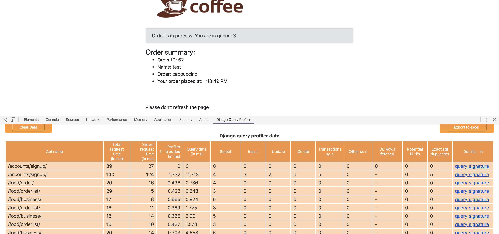

columns in chrome plugin
========================

There are 15 columns in the chrome plugin table:

- Api name:  This is the api name that we see in the network tab in chrome devtools
- Total request time (in ms):  This is the total round-trip time of the request.  This is also the same as what chrome network tab shows for that api
- Server request time (in ms): This is the time the request spends on the server - assuming that the `django-query-profiler`
  middleware is the first one in the list.
- Profiler time added (in ms):  This is the overhead added by profiler to the request
- Query time (in ms): This is the total time taken by all queries for that request
- Select: Count of select sqls
- Insert: Count of insert sqls
- Update: Count of update sqls
- Delete: Count of delete sqls
- Transactional sqls: Count of begin/end transaction sqls
- Other sqls: Count of sqls that we were not able to classify as above five.  Ideally this should never happen
- DB Rows fetched: Count of database rows that the select queries fetch from database.  Note that sqlite does not return number of rows fetched, so it would show up as '-'
- Potential N+1's:  This represents the count of N+1 queries that the profiler found.  If this number seems high, the
  API is definitely something that should be optimized.
- Exact sql duplicates: This represents the count of queries which had the same (query, param) but was executed multiple
  times to the database.  If this number is higher, consider doing `query caching`, or pulling the sql out of the loop
- Details link: This is the url that would show a detailed view, and the recommendation on how to fix the code path
