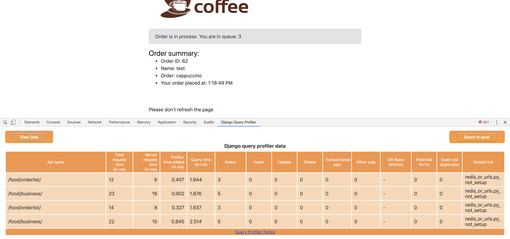

configuration instructions
==========================

as chrome plugin
^^^^^^^^^^^^^^^^
The only places where we will need to change are the settings.py and urls.py file.

**settings.py**::

  from django_query_profiler.settings import *

  INSTALLED_APPS = (
      ...
      'django_query_profiler',
      ...
  )

  MIDDLEWARE = (
      ...
       # Request and all middleware that come after our middleware, would be profiled
      'django_query_profiler.client.middleware.QueryProfilerMiddleware',
      ...
  )

  DATABASES = (
      ...
      # Adding django_query_profiler as a prefix to your ENGINE setting
      # Assuming old ENGINE was "django.db.backends.sqlite3", this would be the new one
      "ENGINE": "django_query_profiler.django.db.backends.sqlite3",
  )

This works for all the databases supported by Django.  In all the databases, the ENGINE settings has to be prepended by `django_query_profiler` for the profiler to work

In case of mysql/mariadb, the ENGINE setting would look like::

  # from "django.db.backends.mysql"
  "ENGINE": "django_query_profiler.django.db.backends.mysql",

In case of postgres, the ENGINE setting would look like::

  # from "django.db.backends.postgresql_psycopg2"
  "ENGINE": "django_query_profiler.django.db.backends.postgresql_psycopg2",

In case of oracle, the ENGINE setting would look like::

  # from "django.db.backends.oracle"
  "ENGINE": "django_query_profiler.django.db.backends.oracle",

**urls.py**::

  # Add this line to existing urls.py
  path('django_query_profiler/', include('django_query_profiler.client.urls'))

See this `PR
<https://github.com/django-query-profiler/django-query-profiler-sample-app/pull/1>`__ on how to configure this in your application,
and how the plugin is going to look like after your configuration

.. image:: ../_static/chrome_plugin.png

as chrome plugin without detailed view
^^^^^^^^^^^^^^^^^^^^^^^^^^^^^^^^^^^^^^
We use redis to store the pickled data of `detailed view`, that gets shown when clicking on the "Details Link" in the chrome extension.
If redis is not available, we would not be able to see the detailed view, but we can still see the summary view.

In that scenario, the only change would be in the application's settings.py.  We don't need to add
`django_query_profiler` to INSTALLED_APPS, and we don't need to add detailed view url to urls.py

**settings.py**::

  from django_query_profiler.settings import *

  MIDDLEWARE = (
      ...
       # Request and all middleware that come after our middleware, would be profiled
      'django_query_profiler.client.middleware.QueryProfilerMiddleware',
      ...
  )

  DATABASES = (
      ...
      # Adding django_query_profiler as a prefix to your ENGINE setting
      # Assuming old ENGINE was "django.db.backends.sqlite3", this would be the new one
      "ENGINE": "django_query_profiler.django.db.backends.sqlite3",
  )

See this `PR
<https://github.com/django-query-profiler/django-query-profiler-sample-app/pull/2>`__ on how to configure this in your application,
and how the plugin is going to look like after your configuration

as context manager
^^^^^^^^^^^^^^^^^^

This is helpful if you want to test things out on a command line - it requires only one change to settings.py

**settings.py**::

  from django_query_profiler.settings import *

  DATABASES = (
      ...
      # Adding django_query_profiler as a prefix to your ENGINE setting
      # Assuming old ENGINE was "django.db.backends.sqlite3", this would be the new one
      "ENGINE": "django_query_profiler.django.db.backends.sqlite3",
  )

See this `PR
<https://github.com/django-query-profiler/django-tip-02/pull/1/files#diff-4adc426e30bc1ad9a8f83ea94a278a51>`_ on how to configure this in your application,

See this `file
<https://github.com/django-query-profiler/django-tip-02/blob/18785d9e44b5f542ce26f555a4bcf18124f788d0/DJANGO_QUERY_PROFILER.md>`_ in the PR to see how to use the context manager
And see how easy it is to spot performance issues :-)
